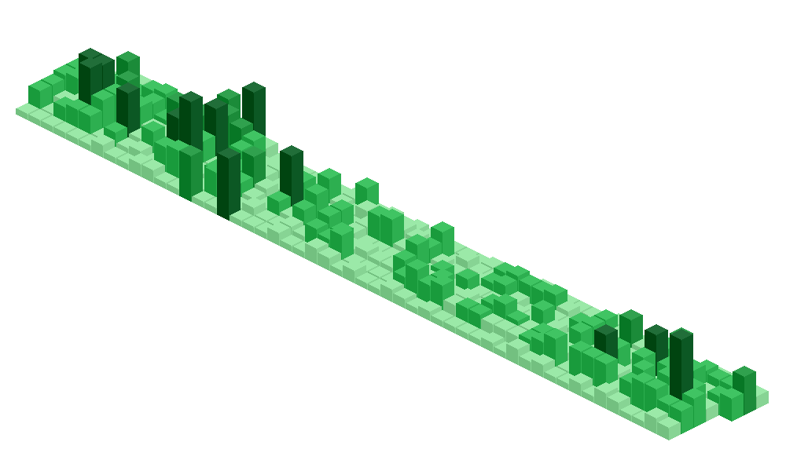
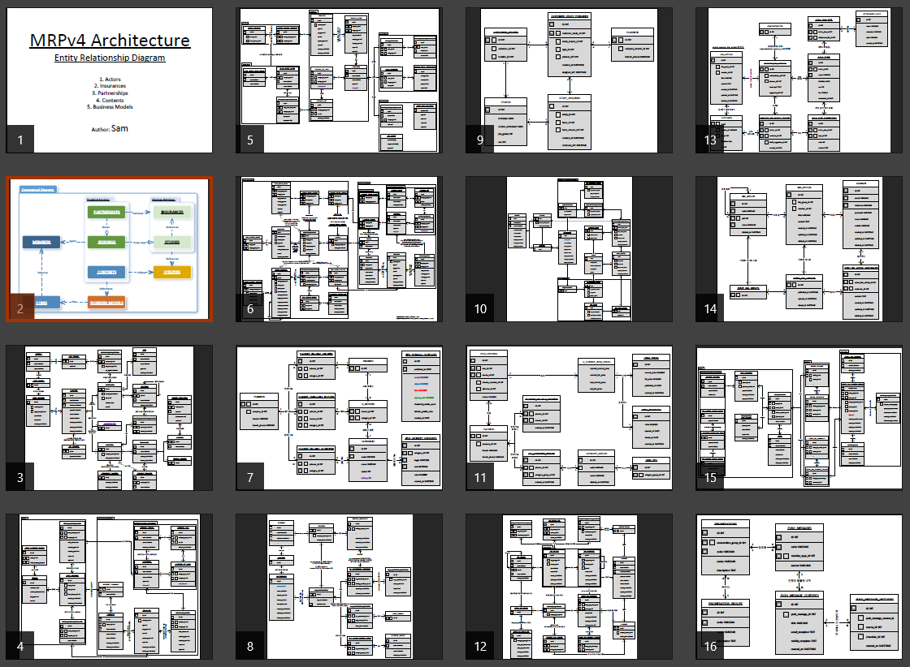

# Detailed Story of [Samchon](https://github.com/samchon)
## Table of Contents
  * [**1. Outline**](#1-outline)
    + [1.1. Profile](#11-profile)
    + [1.2. Educations](#12-educations)
    + [1.3. Awards](#13-awards)
    + [1.4. Skills](#14-skills)
    + [1.5. Experiences](#15-experiences)
  * [**2. Introduction**](#2-introduction)
    + [2.1. For a lifetime](#21-for-a-lifetime)
    + [2.2. Self Improvement](#22-self-improvement)
    + [2.3. Standardization](#23-standardization)
    + [2.4. Documentation](#24-documentation)
    + [2.5. Test Driven Development](#25-test-driven-development)
  * [**3. My Projects**](#3-my-projects)
    + [3.1. Open Source Projets](#31-open-source-projets)
      - [3.1.1. Samchon Framework](#311-samchon-framework)
      - [3.1.2. TSTL](#312-tstl)
      - [3.1.3. TGrid](#313-tgrid)
      - [3.1.4. Mutex Server](#314-mutex-server)
      - [**3.1.5. Nestia**](#315-nestia)
      - [**3.1.6. Safe-TypeORM**](#316-safe-typeorm)
      - [**3.1.7. Backend**](#317-backend)
      - [3.1.8 Miscellaneous](#318-miscellaneous)
    + [3.2. Private Projects](#32-private-projects)
      - [3.2.1. Hansung Timetable](#321-hansung-timetable)
      - [3.2.2. Samchon Simulation](#322-samchon-simulation)
      - [3.2.3. Nam Tree](#323-nam-tree)
  * [**4. Commercial Projects**](#4-commercial-projects)
    + [4.1. SmartCareWorks](#41-smartcareworks)
      - [4.1.1. OraQ (Selene TR-1)](#411-oraq-selene-tr-1)
    + [4.2. Unitech](#42-unitech)
      - [4.2.1. Torpedo Simulator Communication Module](#421-torpedo-simulator-communication-module)
    + [4.3. Hiswill](#43-hiswill)
      - [4.3.1. TSP, Construction Scheduler](#431-tsp-construction-scheduler)
      - [4.3.2. 3D Bin Packing](#432-3d-bin-packing)
      - [4.3.3. Folding](#433-folding)
      - [4.3.4. Auto HL](#434-auto-hl)
      - [4.3.5. Distributed Button Finder](#435-distributed-button-finder)
      - [4.3.6. Cropper](#436-cropper)
      - [4.3.7. Kiosk Pants Editor](#437-kiosk-pants-editor)
    + [4.4. Aijinet](#44-aijinet)
      - [4.4.1. Entity Relationship Diagram](#441-entity-relationship-diagram)
      - [4.4.2. Backend API Server](#442-backend-api-server)
      - [4.4.3. Insurance Engine](#443-insurance-engine)
      - [4.4.4. Private Engine for Special Insurer](#444-private-engine-for-special-insurer)
      - [4.4.5. TypeScript Migration](#445-typescript-migration)

## 1. Outline
### 1.1. Profile
이름: 남 정호

  - 생년월일: 1988-03-11
  - 연락처: 010-3627-0016
  - Github: https://github.com/samchon

### 1.2. Educations
한성대학교, 2011-03 ~ 2014-08

  - 주전공: 정보시스템공학
  - 복수전공: 경영학
  - 학점: 4.16 / 4.50
    - 비고: 조기 졸업

제가 대학교를 다니던 3 년 반을 다시금 돌이켜보면, 참으로 유익했던 시간이었습니다. 별 흥미도 없는 오만가지 과목을 다 공부하며 종일 학교에 있어야만 했던 고등학교 시절과는 다르게, 대학교는 자신이 원하는 분야를 마음대로 선택하고 재량껏 공부할 수 있어서 특히 좋았습니다.

그리고 그렇게 자유롭게 자신이 원하는 것을 배울 수 있던 대학생 시절, 저의 제 1 목표는 "이제 대학생이 되었으니, 대형 프로젝트 한 번 근사하게 만들어보자" 였습니다. 때문에 학교에 다니는 시간을 제하고는, 일과시간의 대부분을 개인 프로젝트를 만드는 데 쏟았습니다. 

그리고 그 중에서도 가장 공을 들였던 프로젝트들을 꼽으라면 단연코, [3.2.2. Samchon Simulation](#322-samchon-simulation) 이 될 것입니다.

### 1.3. Awards
대학교를 졸업한 이래, 오픈소스 프로젝트를 꾸준히 하고 있으며, 대회에도 근근히 참여 중입니다.

다만 회사를 다니며 상용 프로젝트를 개발하는 입장이기에, 대학교를 졸업한 이래 주 관심사는 라이브러리 제작이 되었습니다. 주로 그 날 회사에서 일하다가 무언가 절실히 필요한 기능이 생기거나, 또는 기존 라이브러리에서 불편한 점을 느끼게 되면, 그 날 집에 가서 보완 및 대체 컴포넌트를 만들어보는 식입니다.

그렇게 하루 하루의 보완 및 대체 컴포넌트들이 쌓여가다보면, 그것이 어느새 상당한 양을 이루고, 이를 체계화하다보면 새로운 라이브러리가 탄생하기도 합니다. 그리고 그 라이브러리들이 모여 하나의 패러다임을 이루면, 저의 자작 프레임워크가 탄생하게 되는것입니다.

오픈소스 대회에는 이러한 자작 프레임워크들을 가지고 출전하고 있습니다.

  - [Samchon Simulation](#322-samchon-simulation): 한성대 공학경진대회 2012 은상
  - [Samchon Framework](#311-samchon-framework): 공개소프트웨어개발자대회 2015 일반부 동상
  - [TSTL](#312-tstl): 공개소프트웨어개발자대회 2017 일반부 은상
  - [TGrid](#313-tgrid): 출전 예정

### 1.4. Skills
저는 C++ 과 TypeScript 를 주력으로 하였으되, 굳이 언어나 프레임워크 등에 구애받지는 않습니다.

또한, 데이터 및 아키텍처 설계를 오래도록 해 와 능숙하며, 이를 표준화하고 데에 소질이 있습니다. 그리고 알고리즘을 연구하고 개발하는 데에도 소양이 있어, 최적화도 곧잘 해내고는 합니다. 마지막으로 문서화 및 개념 정리에 숙달하여, 이를 동료 개발자에게 전파하는 것에도 나름 일가견이 있다고 자부합니다.

Skill        | Experiences | Careers | Note
-------------|-------------|---------|-----------------------------------
C++          | 12 년       | 3 년    | 최신 STL 과 Template Meta Programming 에 능함
TypeScript   | 8 년        | 4 년    | 현 한국 랭킹 1 위 (git-awards 기준)
ActionScript | 20 년       | 2 년    | Flex Architecture 를 통해 고급 설계에 입문함
DB/SQL       | 20 년       | 5 년    | ERD 설계에 능함

### 1.5. Experiences
저는 11 살에 프로그래밍에 입문한 뒤, 22 년을 쉬지 않고 꾸준히 개발에 매진해 왔습니다. 그리고 상용 경력은 2014 년에 대학교를 졸업한 이래, 만 5 년 이상을 근무하였으며, 이로써 올해로 6 년차가 되었습니다.

더불어 그간 제가 개발했던 개인 및 상용 프로젝트들에 대한 상세 내역은, 아래 [3. My Projects](#3-my-projects) 및 [4. Commercial Projects](#4-commercial-projects) 단원에 정리해두었으니, 부디 참고해주시기 바랍니다.

  - 프로그래밍 경험: 22 년
  - 총 상용 경력 75 개월
    - 정규직: 62 개월
    - 계약직: 13 개월
  - 이전 급여 (현재 비공개)
    - 정규직: 1 억 원
    - 계약직: 1.6 억 원

Company                             | Entry Date | Leave Date | Form
------------------------------------|------------|------------|-------
[스마트케어웍스](#41-smartcareworks) | 2014-10    | 2015-02    | 계약직
[유니텍 해양연구소](#42-unitech)     | 2015-05    | 2015-07    | 계약직
[히즈윌 부설연구소](#43-hiswill)     | 2015-10    | 2015-11    | 계약직
[히즈윌 부설연구소](#43-hiswill)     | 2015-11    | 2017-01    | 정규직
[아이지넷](#44-aijinet)             | 2017-01    | 2019-12    | 정규직
[아이지넷](#44-aijinet)             | 2020-01    | 2020-07    | 계약직
아키드로우                          | 2021-11    | 재직중      | 정규직

## 2. Introduction
### 2.1. For a lifetime
저는 11 살에 프로그래밍을 시작하였습니다. 당시 "넷츠고에서 멀티미디어 홈페이지 만들기" 라는 책으로 개발에 입문하여 HTML 로 개인 홈페이지를 만드는 것을 시작으로, Flash 와 Php 를 이용해 올 플래시 홈페이지와 게시판을 만드는 등, 이래저래 홈페이지 만드는 재미에 푹 빠져 있었습니다.

지금 와서 생각해보면 참 간단한 홈페이지에 시시콜콜한 답변형 게시판이었지만, 당시의 저는 코딩을 하다가 막혀서 쩔쩔맬 때가 되면, 그것을 악몽으로 다시 꿀 정도로 고생하기도 했었습니다. 그리고 그렇게 1 년을 고생 고생한 끝에 올 플래시 홈페이지를 완성하던 날, 그 날의 성취감과 환희는 아직도 제 기억에 고스란히 남아있습니다,

그리고 그 날 이후 프로그래밍은 저의 제 1 취미가 되었고, 어느덧 22 년이 지났습니다. 지난 22 년 간 개발에서 손을 뗀 적이 없으며, 오늘날에도 여전히 코딩은 저의 제 1 취미입니다. 때문에 저는 일에 관하여 저를 소개함에 있어, 종종 "덕업일치" 라는 표현을 씁니다. 취미가 곧 직업이 되어, 세상 참 재미나게 살고 있다는 의미로써 말입니다.

### 2.2. Self Improvement

저는 대학교를 졸업한 이래로, 앞서 [1.3. Awards](#13-awards) 단원에서 언급했던 바와 같이, 퇴근 후와 주말 등의 여가시간에 오픈소스를 개발해 왔습니다. 특별한 일이 있지 않는 한 daily study 와 commit 을 목표로 꾸준한 자기계발을 해 왔습니다. 

아마도 이를 가장 확연하게 증명할 수 있는 수단은 [제 Github 계정](https://github.com/samchon)이 아닐까 합니다. 위 gif 이미지는 저의 최근 5 년 간 Github 커밋 내역을 그래프화한 것으로써, 제가 그간 오픈소스에 얼마나 기여해왔는지를 가장 잘 보여준다고 생각합니다.

### 2.3. Standardization
저는 표준 개발 절차를 준수하며, 이에 매우 숙달되어 있습니다.

제가 프로그래밍에 막 입문하였던 어린 시절에는, 설계나 자료구조 뭐 이런 것에 대하여 전혀 모른 채, 프로그램을 그야말로 아무렇게나 만들었습니다. 하지만, 개발에 취미를 붙인 이래 이런 저런 프로그램을 만들어나가면서, 그리고 만들어나가는 개개별별 프로그램의 규모가 점점 커져나감에 따라, 설계 및 구조화된 프로그래밍의 중요성을 깨닫게 되었습니다.

특히 20 대가 되고나서부터는, 다른 대형 프로젝트들이 그들의 아키텍처를 어떻게 설계하고 프로그램 코드를 어떤 식으로 짜는지 등이 궁금하여, 몇 가지 프로젝트를 분석해 본 바 있습니다. 그 중 특히 심도있게 관찰했던 것이 [Flex Framework](http://flex.apache.org/) 및 [Tour De Flex](http://flex.apache.org/tourdeflex/index.html) 의 여러 UI 컴포넌트들, 그리고 Microsoft 와 EA 가 각각 구현했던 C++ STL 라이브러리입니다. 이들 코드는 은연 중 저에게 많은 영향을 주어, [저의 Github](https://github.com/samchon) 코드에 그들의 스타일이 은은하게 묻어있고는 합니다.

더불어 지금으로부터 약 10 년 전인 2011 년, 제 나름의 초대형 프로젝트 [3.2.2. Samchon Simulation](#322-samchon-simulation) (약 30 만 라인) 에서 오만가지 난항을 다 겪으며, 저는 아키텍처 설계의 중요성과 정체화된 프로그래밍의 중요성을 다시 한 번 체감하게 됩니다. 그리고 동시에 [2.4. 문서화](#24-documentation) 및 [2.5. TDD](#25-test-driven-development) 의 중요성을 뼈에 사묻히도록 느끼게 되어, 이 날 이후로는 [2.4. 문서화](#24-documentation) 및 [2.5. TDD](#25-test-driven-development) 에도 각별한 주의를 기울이고 있습니다.

### 2.4. Documentation
저는 개발 프로젝트를 진행함에 있어, 문서화를 매우 중요하게 여기며, 이를 항상 실천합니다.

오픈소스 프로젝트를 진행함에 있어서도, Github 가 권장하는 문서 가이드 라인을 철저하게 준수하고 있습니다. 새로운 기능을 개발하거나 혹은 버그를 수정함에 있어서도 반드시 관련 issue 를 작성하고, 이에 대한 commit 도 반드시 issue 에 대한 reference 가 달리도록 하고 있습니다. 더불어 API 및 가이드 문서에 대해서도 철저하게 하는 편입니다.

  - TSTL 의 Issues: https://github.com/samchon/tstl/issues?q=is%3Aissue
  - TGrid 의 Guide Documents: https://tgrid.com
  - Mutex Server 의 API Documents: https://mutex.dev/api
  - Safe-TypeORM 의 README 문서: https://github.com/samchon/safe-typeorm

또한, 회사에서 상용 프로젝트를 진행할 때도 이 점은 동일하며, 어떤 면에서는 오픈 소스보다 훨씬 철저하게 합니다. 상용 프로젝트 역시 모든 주요 개발 사안들에 대하여 issue 를 작성하고 있으며, 반드시 관련자들을 participants 로 등록하여 전파합니다. 

그리고 매일 개발 업무일지를 작성하여 그 날에 있던 일들을 정리하며, 분기마다 그간 개발상황에 대한 점검 및 향후 개선사항들에 대하여 정리하여 보고하고 있습니다. 더불어 본인이 구현한 알고리즘이나 API 가 개념상 어려운 부분이 있다면, 반드시 상세 매뉴얼을 제작하여 관련자들에게 항시 교육해왔습니다.

> 회사에서 작성했던 이슈 및 일일 업무일지는 퇴근하는 길에 핸드폰으로 복기하고, 새로운 기능이 필요하거나 기존 라이브러리도 충당이 안 되는 요소들이 있으면, 집에 가서 오픈소스로 직접 구현해보기도 합니다.

### 2.5. Test Driven Development
저는 [2.3. Standardization](#23-standardization) 단원에서 언급한 정제화된 설계 및 표준화만큼이나, 테스트 기반 개발에 대하여도 매우 중하게 여깁니다. 

때문에 저는 그 어떤 프로그램이나 솔루션을 만들던, 언제나 테스트 자동화 프로그램을 함께 제작합니다. 테스트 자동화 프로그램을 만듦에 있어 타 시스템과의 연동 문제가 걸려 애로사항이 피어나거든, 해당 시스템을 유사하게 흉내내서라도 검증 수단을 갖추는 것을 지향합니다.

더불어 저는 어떤 프로그램을 만들 때, 본 기능부터 제작하기보다 제일 먼저 자료구조 및 인터페이스 설계를 먼저 합니다. 그 다음에도 본 프로그램을 만드는 게 아니라, 앞서 제작하였던 자료구조 및 인터페이스를 기초로, 테스트 자동화 프로그램부터 만듦니다. 본 프로그램 제작은 이 셋 중, 가장 마지막에 합니다.

이러한 저의 특성은 백엔드나 API 서버 등을 제작할 때 가장 두드러져, 저 준칙에서 벗어나는 일이 없습니다. 이후의 [4. Commercial Projects](#4-commercial-projects) 단원에 보면, 비고사항 중에 유독 "무 에러" 라는 단어가 많이 눈에 띌 것입니다. 물론, 이게 다 Test Driven Development 를 철저히 준수한 덕에 거둘 수 있던 성과입니다. 

  - 개발 순서
    - 자료구조 및 인터페이스 제작
    - 테스트 자동화 프로그램 제작
    - 본 프로그램 제작
  - Github Actions
    - https://github.com/samchon/tstl/runs/837330734?check_suite_focus=true
    - https://github.com/samchon/tgrid/runs/837437346?check_suite_focus=true
    - https://github.com/samchon/mutex-server/runs/839743359?check_suite_focus=true

> #### My Opinion
> 혹자는 Test Driven Development 를 준수하면, 개발 시간이 더 오래 걸리고 이를 지키는 과정이 무던히도 번거롭다고 말합니다. 하지만 저는, 오히려 이 방법 TDD 야말로, 프로그램을 가장 빠르고 안전하게 만드는, 최선의 지름길이자 정도라고 생각합니다.

## 3. My Projects
### 3.1. Open Source Projets 
#### 3.1.1. Samchon Framework
ONN (Object Oriented Network) Framework for C++ & Flex.

  - Repository: https://github.com/samchon/framework
  - Guide Documents: https://github.com/samchon/framework/wiki
  - API Documents
    - C++: http://samchon.github.io/framework/api/cpp/
    - Flex: http://samchon.github.io/framework/api/v1.0/flex/
  - Note: 공개소프트웨어개발자대회 2015 동상 수상

`samchon-framework` 는, 과거 제가 알고리즘 및 최적화에 관련된 것은 C++ 로 만들고 프론트나 데모 어플리케이션 등은 Flex 로 만들던 시절에, C++ 과 Flex 의 원활한 연동을 위해 만들었던 네트워크 프레임워크입니다.

OON (Object Oriented Network) 와 Invoke 라는 특유의 패턴을 통하여, 복잡한 네트워크 시스템도 객체적인 접근을 통하여 쉽게 풀어나갈 수 있는 것이 특징입니다. 저의 개인 프로젝트인 [3.2.2. Samchon Simulation](#322-samchon-simulation) 과, 저의 첫 상용 프로젝트의 [4.1.1. OraQ (Selene TR-1)](#411-oraq-selene-tr-1) 이, 바로 이 `samchon-framework` 를 사용해 만들어졌습니다.

다만, `samchon-framework` 의 지원 언어에 TypeScript 를 추가하고 OON (Object Oriented Network) 에 대하여 더 심도있게 연구하는 와중에, RFC (Remote Function Call) 에 대한 실마리를 찾게 되었습니다. 때문에 2018 년 말, 오래도록 개발해오던 `samchon-framework` 를 중단하고, [3.1.3. TGrid](#313-tgrid) 를 만들게 됩니다.

#### 3.1.2. TSTL
TypeScript Standard Template Library.

  - Repository: https://github.com/samchon/tstl
  - API Documents: https://tstl.dev/api
  - Note: 공개소프트웨어개발자대회 2017 은상 수상

`tstl` 은 C++ STL (Standard Template Library: C++ 표준화 위원회가 매 3 년마다 발표하는 C++ 표준 인터페이스 규약) 의 인터페이스를, TypeScript 로 구현한 프로젝트입니다. 따라서 C++ 에서 제공되는 다양한 표준 라이브러리들을, TypeScript 에서 동일하게 제공하고 있습니다.

제가 `tstl` 을 만든 가장 큰 이유 중 하나는, 바로 C++ Migration 에 있습니다. 저는 알고리즘을 연구 및 개발할 때, TypeScript 로 prototype 을 빠르게 제작하여 검증해보고, 나중에 C++ 로 옮기며 이를 최적화하고는 합니다. 그리고 바로 이 때, TypeScript 로 만든 prototype 의 주요 인터페이스 및 기저 코드가 C++ 과 유사하면 마이그레이션이 매우 수월하기에, 번거로움을 감수하고라도 `tstl` 을 만든 것입니다.

다만 이렇게 만들어놓고보니, `tstl` 이 JS 기본 라이브러리가 미처 지원하지 못하는 다양한 자료구조나 알고리즘 등을 보완해주기에, 오픈소스로 널리 공개하게 되었습니다. 더불어 C++ 표준 스펙은 아니되, TypeScript 개발환경 상 부디 있었으면 좋겠다 싶은 기능들은, extension module 로써 제공하고 있습니다.

#### 3.1.3. TGrid
TypeScript Grid Computing Framework.

  - Repository: https://github.com/samchon/tgrid
  - Guide Documents: https://tgrid.com
  - API Documents: https://tgrid.com/api
  - Key Concept: RFC (Remote Function Call)

`tgrid` 는 [3.1.2. TSTL](#312-tstl) 의 thread 및 network 에 관한 extension module 이며 동시에, TypeScript 에서 RFC (Remote Function Call) 개념을 통해, Grid Computing 을 매우 쉽게 구현할 수 있도록 도와주는 프레임워크입니다.

이 Remote Function Call 은 원격 시스템의 함수를 마치 자신의 것인양 직접 호출할 수 있다라는 의미로써, 이를 활용하면 여러 대의 컴퓨터를 네트워크 통신으로 묶어 만드는 분산처리시스템의 프로그램 코드와, 한 대의 컴퓨터로 만드는 프로그램의 비지니스 로직 코드가 모두 동일 (similar) 해지게 됩니다.

더불어 `tgrid` 는 여지껏 제가 만든 오픈소스 프로젝트 중, 문서화가 가장 잘 된 프로젝트라 자부합니다. [가이드 문서](https://tgrid.com) 를 통하여 `tgrid` 의 다양한 개념을 익힐 수 있고, 제공되는 다양한 예제 프로젝트들을 따라하면서 Remote Function Call 의 유용성을 능히 체험할 수 있습니다.

#### 3.1.4. Mutex Server
Critical sections in the network level.

  - Repository: https://github.com/samchon/mutex-server
  - API Documents: https://mutex.dev/api

`mutex-server` 는 C++ STL 에서 정의한 임계영역에 관련된 컴포넌트들을, 개별 컴퓨터가 아닌 네트워크 수준에서 사용할 수 있게 해 주는, `tstl` 의 critical section 에 관련된 extension module 입니다. 따라서 `mutex-server` 를 이용하면, 뮤텍스나 세마포어 등의 임계영역 관련 컴포넌트들을, 전 네트워크 영역에서 사용할 수 있습니다.

또한, `mutex-server` 는 급작스러운 네트워크 연결 해제에 대한 안전 장치가 마련되어있습니다. 따라서 `mutex-server` 에 접속된 특정 클라이언트가 돌연 접속 종료된다하더라도, 해당 클라이언트가 취득한 모든 lock 과 시도했던 acquire 등은 모두 자동으로 반환 및 취소되기에, `mutex-server` 는 안전합니다.

#### 3.1.5. Nestia
Automatic SDK generator for the NestJS.

  - Repository: https://github.com/samchon/nestia

Nestia 는 NestJS 로 작성한 백엔드 소스 코드를 컴파일 수준에사 분석하여, 클라이언트 개발자가 사용할 수 있는 SDK 라이브러리를 자동으로 만들어줍니다. 때문에 Nestia 를 사용하면, 이전처럼 API 문서를 만들기 위하여 swagger 주석을 작성하는 등의, 불필요한 작업을 일절 할 필요가 없어집니다. 

이는 클라이언트 개발자도 동일하여, 이전처럼 swagger 문서를 해독하여 API 연동 인터페이스를 직접 만드는 일 따위의 수고스러움을 더 이상 감내하지 않아도 됩니다. 단지 nestia 가 만들어 준 sdk 를 import 하고, async await 심벌을 통하여 sdk 가 제공해주는 api 함수들을 호출하기만 하면 될 뿐입니다.

#### 3.1.6. Safe-TypeORM
Enhance TypeORM in the compilation level.

  - Repository: https://github.com/samchon/safe-typeorm

Safe-TypeORM 은, TypeORM 을 컴파일 수준에서 강화해주며, 앱 조인을 통한 퍼포먼스 튜닝 자동화 도구들을 제공해주는 라이브러리입니다. 본디 TypeORM 의 차기 버전을 기다리던 사용자 입장이었으되, 이를 기다리다 지쳐 직접 만들게 되었습니다.

때문에 Safe-TypeORM 을 이용하면, SQL 쿼리를 작성하며 생기는 오류들이 모두 IDE 나 컴파일 단계에서 검출되며 자동 완성을 지원하기에, 안전한 쿼리를 매우 편리하게 작성할 수 있습니다. 그리고 사용자는 오직 ORM 과 JSON 인터페이스 설계에만 집중하면 되도록, SELECT 와 JOIN 및 INSERT 쿼리 등을 모두 자동으로 작성하고 최적화 해 줍니다.

  - SQL 쿼리 작성시
    - 에러가 IDE 및 컴파일 단계에서 검출
    - 자동 완성 및 타입 힌트 지원
  - 앱 조인이 매우 쉬우며, DB 조인과 인터페이스가 동일
  - JSON 데이터 구성시, 조인 및 퍼포먼스 튜닝이 자동으로

#### 3.1.7. Backend
https://github.com/samchon/backend

제가 현재 재직 중인 아키드로우에는, 신입 백엔드 개발자들이 많습니다. [samchon/backend](https://github.com/samchon/baackend) 는 이들 신입 백엔드 개발자들을 보다 체계적으로 교육하기 위하여 특별히 만든, 일종의 예제 프로젝트입니다. 

이 예제 프로젝트는, 요구사항을 분석하여 DB 아키텍처와 API 인터페이스를 설계하고 테스트 자동화 프로그램을 작성한 후 메인 서버 프로그램을 작성하는 등, 일련의 백엔드 설계 및 개발 과정을 모범적으로 보여주기 위하여 제작하였습니다. 동시에 무중단 업데이트나 스케쥴러 구성을 어떻게 하는 지 등, 백엔드의 인프라를 구축함에 있어 특정 벤더에 영향받지 않으며 로컬에서도 재현 가능한, 중립적인 백엔드 환경 구성 등을 다루고 있습니다.

더하여 이 신입 백엔드 개발자들에게 교육을 해 줌에 있어, 본인이 그간 백엔드를 개발하며 느껴왔던 여러 불편하고 비효율적인 점들을 굳이 되물림하지 않았으면 좋겠다는 생각을 하였습니다. 이에 교육 자료를 만듦에 있어, [3.1.5. Nesita](#315-nestia) 나 [3.1.6. Safe-TypeORM](#316-safe-typeorm) 등도 함께 개발하게 되었습니다. 

  - API 를 만듦에 있어 swaggeer 등의 불필요한 문서 작성을 하지 않는다.
  - SQL 을 작성함에 있어, 에러를 컴파일 타임에 잡아준다.
  - 신입에게 어려운 DB 퍼포먼스 튜닝을, 라이브러리 [safe-typeorm](#316-safe-typeorm) 이 대신 해 준다. 

#### 3.1.8. Miscellaneous
저는 [3.1.2. TSTL](#312-tstl) 과 [3.1.3. TGrid](#313-tgrid) 및 [3.1.4. Mutex Server](#314-mutex-server), 그리고 [4.3.2. 3D Bin Packing](#432-3d-bin-packing) 이외에도 다수의 오픈소스 라이브러리들을 제작, 배포한 바 있습니다. 

이들 여타 라이브러리들은 주로 저 개인의 필요에 의해 제작하였으되, [ecol](https://github.com/samchon/ecol) 이나 [sxml](https://github.com/samchon/sxml) 처럼, 저도 모르는 새애 여러 사람에 의해 근근히 쓰이는 경우도 있었습니다.

  - tiny libaries
    - [cagen](https://github.com/samchon/cagen): 경우의 수 생성기
    - [ecol](https://github.com/samchon/ecol): Event Collections
    - [sxml](https://github.com/samchon/sxml): Simple XML library
  - plugins for others libraries
    - [typeorm-model](https://github.com/samchon/typeorm-model): TypeORM 에서 Laravel 스타일의 Model 을 구현
    - [gitbook-plugin-import](https://github.com/samchon/gitbook-plugin-import): Gitbook 에서 문서 간 import 태그 구현
    - [gitbook-plugin-hide-navigation-buttons](https://github.com/samchon/gitbook-plugin-hide-navigation-buttons): 불필요한 navigation 버튼 가리기
    - [gitbook-plugin-scroll-to-top](https://github.com/samchon/gitbook-plugin-scroll-to-top): 페이지 최상위로 이동 버튼 추가
    - [typedoc-plugin-exclude-references](https://github.com/samchon/typedoc-plugin-exclude-references): TypeDoc 에서 module 모드 사용시 reference 감추기

### 3.2. Private Projects
#### 3.2.1. Hansung Timetable
Hansung Timetable Simulator.

  - Manual: [assets/manuals/hansung-timetable.pdf](assets/manuals/hansung-timetable.pdf)
  - Language: Flex/Air (ActionScript 3.0)

대학교에 입학하고 1 년을 다녀보니, 수강신청이 매번 고역임을 깨닫게 됩니다. 특히 제가 다닌 한성대의 경우에는 당시 강의계획 안내가 워낙 엉터리던지라, 수강신청을 하기 전에 미리 과목을 고르고 시간표를 먼저 작성해보는 게 매우 고된 일이었습니다. 

때문에 1 학년 겨울방학이 오던 날, 저는 시간표를 미리 작성해볼 수 있는 프로그램 `hansung-timetable` 을 만들어 학생들에게 배포하게 됩니다. 이 프로그램을 통해 학생들은 시간표를 미리 작성해 볼 수 있었으며, 작성한 시간표를 프로그램 내에서 저장하거나 불러올 수 있었고, 시간표 그 자체를 워드나 엑셀 파일 등으로도 저장할 수 있었습니다.

> 오로지 저만 사용한 기능으로, 수강신청을 자동으로 할 수 있는 기능이 있습니다.

당시 이 프로그램을 만들고 학번을 기준으로 한 순 사용자만 3 천명에 달하였을 정도로, 학생들 사이에서 널리 쓰였습니다. 덕분에 어느 강의를 들어가던, 저를 알아보는 사람이 꼭 한 둘 이상씩은 있었습니다. 더불어 `hansung-timetable` 은 제가 개인 프로젝트로 만든 프로그램 중, 유일하게 라이브러리나 프레임워크가 아닌, 대중적인 프로그램이기도 했습니다.

#### 3.2.2. Samchon Simulation
Stock Simulation & Back Testing.

  - Manual: [assets/manuals/samchon-simulation.pdf](assets/manuals/samchon-simulation.pdf)
  - Demo Application: http://samchon.org/simulation
  - Languages
    - Flex (ActionScript 3.0)
    - C++
    - Php
    - MySQL
  - Programs
    - Samchon Simulation Cloud (Demo)
    - Samchon Simulation Data Miner
    - Samchon Simulation Auto Trader

`samchon-simulation` 은, 제가 대학교를 다니던 3 년 반을 모조리 불살라 만든, 주식 시뮬레이션 및 자동 매매에 관한 프로그램입니다. 주 기능은 시세와 재무정보 조회로부터 시작하여, Back Testing 이나 Montecarlo Simulation 등 주식 자동 매매를 위한 사전 시뮬레이션에 관한 것입니다. 만약 자세한 내용이 궁금하시다면, 첨부된 [매뉴얼](assets/manuals/samchon-simulation.pdf) 을 참고하시거나, [Demo Application](http://samchon.org/simulation) 에 접속하여 직접 사용해보시어도 좋습니다.

더불어 `samchon-simulation` 은 워낙 전체 프로그램의 규모가 컸기에 (약 30 만 라인), 3년 반 동안 무수한 시행착오를 겪어야 했는데, 그 과정에서 숱한 리팩토링과 모듈화를 반복 숙달할 수 있었습니다. 또한 그 과정에서, 아키텍처 설계의 중요성을 그 누구보다 절실히 느껴, 아키텍처 설계에 입문하게 되는 계기가 되기도 했던 그런 프로젝트입니다.

또한, `samchon-simulation` 은 주 알고리즘 및 연산은 C++ 로 만들었고, 프론트 어플리케이션은 Flex 로 만들었습니다. 게다가 데모 버전은 클라우드 형태로 만들었기에, C++ 과 Flex 간에 네트워크 통신을 통한 상호 연동이 필요습니다. 바로 이 때 만들었던 연동 모듈이, 후일 상용 프로젝트 [4.1.1. OraQ (Selene TR-1)](#411-oraq-selene-tr-1) 에서 쓰인 [3.1.1. Samchon Framework](#311-samchon-framework) 입니다.

#### 3.2.3. Nam Tree
Complicate Dicision Tree.

  - Manual: [assets/manuals/nam-tree.pdf](assets/manuals/nam-tree.pdf)
  - Demo Aplication: http://samchon.org/simulation/index.php?window=BackTesting
  - Languages
    - Flex (ActionScript 3.0)
    - C++

`nam-tree` 는 [3.2.2. Samchon Simulation](#322-samchon-simulation) 에서 복잡한 자동 매매 조건을 시각화하기 위하여 개발한 복합 의사결정 모형으로써, "세상에 존재하는 모든 논리조건을 표현할 수 있다" 를 모토로 만든 자작 모델입니다.

특이사항으로는 계층 구조를 통해 AND 와 OR 및 filtered condition 등을 표현할 수 있으며, 함수 그 자체를 객체로 간주하여 조건문의 각 항에 삽입할 수 있습니다. 또한, exploration 이라 하여, 최적의 조건문을 스스로 찾아주는 기능 또한 있습니다.

혹 자세한 내용이 궁금하시다면, 첨부된 [매뉴얼](assets/manuals/nam-tree.pdf) 을 참고해주십시오.

## 4. Commercial Projects
### 4.1. SmartCareWorks
#### 4.1.1. OraQ (Selene TR-1)
Cloud DICOM (PACS) Media Manager.

  - 개발 기여도: 80 %
  - 작성 언어
    - C++
    - Flex (Actionscript 3.0)
    - Pixel Bender
    - MS-SQL
  - 특징
    - 클라우드 어플리케이션 (웹 페이지)
    - 웹과 C++ 간 연동 필요 (DICOM 라이브러리가 전부 C++ 기반)
    - GPU Programming 구현 필요
      - 이미지 한 장에 수백 MB ~ 수 GB 를 상회
      - 이를 20 프레임 단위로 이펙트 효과를 줄 수 있어야 함
    - 서버 전체 단위의 임계영역 제어 필요
  - 초기 매뉴얼: [assets/manuals/oraq.pdf](assets/manuals/oraq.pdf)
  - 자세한 이야기: [ORAQ.md](ORAQ.md)

OraQ (일본에서는 Selene TR-1) 는 제가 대학교를 졸업하고나서 처음 개발했던 상용 프로젝트로써, 제가 여지껏 했던 모든 프로젝트를 통들어 가장 난이도가 높고, 하지만 시간은 가장 촉박했던 그런 프로젝트입니다. 그리고 동시에, 당시 신입이던 저에게 "이보다 더 좋은 기회가 있을까?" 싶은, 그런 프로젝트이기도 했습니다.

다만 저 나름대로 믿는 구석이 있었던게, 저는 [3.1.1. Samchon Framework](#311-samchon-framework) 라는, OraQ 를 구현하는데 딱 알맞은 수단을 가지고 있었기 때문입니다. 2014 년 당시 웹에서 GPU Programming 이 가능한 수단은 Flex (ActionScript 3.0) 가 가장 유력하였는데, OraQ 를 구현하려면 다시금 이 Flex 를 C++ 과 연동할 수 있어야했으니, C++ 과 Flex 를 네트워크 수준에서 연동하려고 만들었던 [3.1.1. Samchon Framework](#311-samchon-framework) 가 그야말로 제격이었던 것입니다.

때문에 저는 당시, JSP 나 PHP 같은 전통적인 웹 기술 스택을 과감히 포기하고, 웹 서버와 어플리케이션 전체를 [3.1.1. Samchon Framework](#311-samchon-framework) 를 기반으로 하여 직접 만듦으로써, 프로젝트를 온전히 완수할 수 있었습니다. 그리고 무언가 어려운 것을 나의 힘으로 해냈다는 자신감과 함께, 처우도 큰 폭으로 변화하였으니, 다시 돌이켜봐도 저는 참 운이 좋았던 것 같습니다. 졸업 후 신입 개발자가 되자마자 첫 상용 프로젝트로써, 이런 큰 기회를 거머쥘 수 있었으니 말입니다.

### 4.2. Unitech
#### 4.2.1. Torpedo Simulator Communication Module
Solving mis-designed hardward by SDN (Software Defined Network).

  - 기여도: 0 %
  - 작성 언어: C++ (MFC)
  - 기간: 2 달
    - 비고: 중도 중단됨

해군에서 어뢰 시뮬레이터를 제작하는데, 그것의 물리적은 형태는 여러 대의 컴퓨터를 온 보드에 납땜하여 장착한, 다소 기괴한 모습이었습니다. 그리고 그보다 더 기괴했던 것은, 보드 위의 각 컴퓨터 간에, 네트워크 연결 구조가 잘못 이어져있었다는 것이었습니다.

이를 해결하는 가장 좋은 방법은, 하드웨어를 다시 설계하여 제작하는 것이었으나, 이미 하드웨어 생산을 다 끝마쳐 그러할 수 없었습니다. 저는 이 문제를 해결하기 위하여 일종의 SDN (Software Defined Network) 시스템을 구현하였습니다. 물리적으로 해결할 수 없으니 논리적으로, 소켓 프로그래밍에 일종의 Proxy 패턴을 도입하여 이를 소프트웨어적으로 해결하였습니다.

저 개인적으로는 이 프로젝트가 참 재미나고 유익하였습니다만, 해당 프로젝트는 행정 절차적인 이유로 도중에 중단되어버렸습니다. 본인의 해결 방안이 중대 아키텍처 변경에 해당하는데, 이게 규정상 저같은 신입 직원에게 주어질 수 있는 권한이 아니라는, 뭐 그런 문제였습니다.

### 4.3. Hiswill
#### 4.3.1. TSP, Construction Scheduler
TSP (Traveling Salesman Problem) 솔루션.

  - 개발 기여도: 100 %
  - 작성 언어: C++
  - 적용 알고리즘
    - [K-means](https://en.wikipedia.org/wiki/K-means_clustering)
    - Factorial

히즈윌의 시공팀에서 무려 전국 1,300 개의 지점을 순회하며 공사를 해야했던 일이 있습니다. 다만, 1,300 개 지점에 대하여 순회 계획을 사람이 일일히 짜기에는 경우의 수가 무려 1,300! 개에 이르던 지라, 이에 관련된 프로그램을 만들기로 합니다.

저는 이 문제를 [K-means](https://en.wikipedia.org/wiki/K-means_clustering) 와 Factorial 알고리즘을 조합하여 해결하였습니다. 전체 지점을 8 개의 집단으로 나눈 후, Factorial 로 집단 간 순회 순서를 정하고, 다시 개별 집단을 그보다 작은 8 개의 소집단으로 나눈 후, Factorial 로 소집잔들의 순회 순서를 또 정하는 등, 동일한 과정을 말단 지점까지 반복하여 이 문제를 해결했었습니다.

더불어 이 때부터 제가 본격적으로 상용 알고리즘을 연구·개발하게 되는데, 프로젝트를 진행하면 할수록, 이 TSP 프로젝트처럼 경우의 수를 다뤄야 하는 일이 점점 많아지게 됩니다. 이에 따라 저는 [cagen](https://github.com/samchon/cagen) 이란 경우의 수 생성기 라이브러리를 빌드하게 됩니다.

#### 4.3.2. 3D Bin Packing
3-dimensional spatial layout optimization.

  - 개발 기여도: 100 %
  - Repository: https://github.com/betterwaysystems/packer
  - Demo Site: http://betterwaysystems.github.io/packer/demo

3D Bin Packing 은 본래 회사에서 목적한 바가 있어 만들었던 상용 프로젝트였습니다 (포장물 배치 최적화). 다만 회사의 어떠한 사정으로 인해 추진하던 계획이 돌연 취소됨에 따라, 회사 이름이라도 PR 하고자 오픈소스로 공개하게 되었던, 좀 특이한 사연을 가진 프로젝트입니다.

어쨋든 저는 이 프로젝트를 개발하면서, 동시에 3D Bin Packing 에 관련된 논문들을 탐독하면서, 공간 좌표 및 배치 최적화에 관한 나름의 노하우를 익히게 됩니다. 그리고 이 때 익혔던 공간 최적화에 관한 노하우는, 추후 히즈윌의 [4.3.5. Folding](#435-folding) 과 아이지넷의 [4.4.3. Insurance Engine](#443-insurance-engine) 을 만드는 데 매우 큰 도움이 되었습니다.

#### 4.3.3. Folding
Folding and Cutting Optimization.

  - 개발 기여도: 100 %
  - 작성 언어: TypeScript

인쇄 회사에서 책을 만들고자 할 때, 가령 A4 용지 크기의 책을 만든다 그러면, 실제 공정에서 각 페이지는 A4 보다 훨씬 큰 종이에 인쇄됩니다. 그리고 이를 접지 후 재단 및 제본하여 책으로 만들게 됩니다. 또한, 각 페이지에 들어가는 후처리 공정에 따라, 페이지의 배치나 사용하는 용지의 크기 등이 달라지게 됩니다.

그리고 책을 대량으로 제본하는 경우, 이러한 접지 및 재단의 종류 및 배치에 따라, 그 비용이 천차만별로 달라지게 됩니다. `folding` 은 이러한 접지 및 제본 공정에 대한 최적 해답을 구해주는 프로젝트로써, 단 한 마디로 요약하면, 접지계의 [4.3.2. 3D Bin Packing](#432-3d-bin-packing) 이라 할 수 있겠습니다.

#### 4.3.4. Auto HL
Un-structured Factory Automation with Network.

  - 개발 기여도: 100 %
  - 작성 언어
    - Au3
    - TypeScript

히즈윌은 오래된 구형 레이저 절단기를 여러 대 가지고 있었습니다. 다만 이 구형 레이저 절단기는 이를 자동화할 수 있는 드라이버나 인터페이스 등 그 무엇도 제공하지 않으며, 단지 그림판 수준의 조악한 편집기 (HL) 만을 제공할 뿐입니다. 

`auto-hl` 은 바로 이러한 레이저 절단기와 HL 을 자동화하는 프로젝트입니다. 저는 이를 매크로 프로그램을 통해 HL 에서 발생하는 모든 오브젝트 및 이벤트 내역을 추출하고 분석하여, 이를 서버 단위에서 통제할 수 있도록 하였습니다. 

따라서 장비와 연결된 각 프로그램에는 HL 및 서버와 연동하기 위한 클라이언트 프로그램이 설치되었습니다. 그리고 중앙에는 이를 통제하기 위한 서버 프로그램이 설치되었으며, 레이저 절단기가 여러 대이기에 마치 Load Balancer 같은 기능을 구현하여, 서버로부터 클라이언트로 각 작업이 고르게 분배되도록 하였습니다.

#### 4.3.5. Distributed Button Finder
Image Recognizer with Distributed Processing System.

  - 개발 기여도: 50 %
  - 작성 언어
    - C++
    - TypeScript

히즈윌이라는 회사는 소품종 다량생산을 모토로 하는 인쇄 전문 회사입니다 (브랜드명 레드프린팅). 때문에 그 공장에서는 자체 혹은 외주 생산을 통해 월 수십만 종에 이르는 제품들이 생산되고는 합니다. 덕분에, 공장 근로자들에게 생산 완료된 제품의 원 발주자 및 주문 정보를 찾는 일은 언제나 매우 고되었다고 합니다.

당시 히즈윌의 연구소장님은 이 문제를 해결하고자, "유사 이미지 검색 알고리즘을 쓰자" 라는 나름 창의적인 해법을 제시하셨습니다. 다만, 워낙 다양한 제품을 생산하기에 이 "유사 이미지 검색" 이 단 한 대의 컴퓨터로는 충당이 안 되었고, 때문에 여러 대의 컴퓨터를 사용하는 "분산처리시스템" 이 구축되어야 했습니다. 

그리고 당시 제가 한 일이 바로 이 "분산처리시스템" 를 구현하는 일이었습니다. TypeScript 와 NodeJS 로 분산처리시스템을 구현하고, NodeJS 와 C++ 이미지 검색 라이브러리와 연동함으로써, 이 문제를 말끔히 해결하였습니다.

더불어 이 때 분산처리시스템을 구현하기 위해 사용한 게 바로 [3.1.1. Samchon Framework](#311-samchon-framework) 의 `parallel` 모듈이며, 이 과정에서 RFC (Remote Function Call) 에 대한 실마리를 얻어, 추후 [3.1.3. TGrid](#313-tgrid) 를 제작하게 되는 바탕이 되기도 한 프로젝트입니다.

#### 4.3.6. Cropper
Polyline Separator with Button Finder.

  - 개발 기여도: 100 %
  - 작성 언어
    - Flex/Air (ActionScript 3.0)

히즈윌은 버튼 (동그랗고 납작하게 생긴 깡통, 주로 유치원 어린이들의 이름표에 쓰임) 에 붙일 스티커를 제작할 때, 여러 이미지를 종이 한 장에 몰아 인쇄한 후, 재단하여 분리·사용합니다. 따라서 인쇄된 대형 스티커 용지로부터 각자의 이미지를 분리하고, 개별 주문건을 찾아 매칭해줘야 합니다.

Cropper 는 사용자가 폴리라인을 그려 각 이미지 인스턴스를 분리하고, 이를 [4.3.6. Distributed Button Finder](#436-distributed-button-finder) 에 연동하여 원 주문 건을 찾아주는 솔루션입니다.

> 본래는 Free Nesting 을 구현, 각 인스턴스의 배치 및 분리도 모두 자동화하려고 했었습니다. 
> 
> 다만 관련 논문을 찾아보니, Free Nesting 을 구현하기 위한 가장 최적의 솔루션은 유전자 알고리즘이었으며, 이 유전자 알고리즘이라는 게 100 % 정확성을 보장하지 않는 데다가, 소요시간이 무던히 긴 점 등이 방해가 되어 채택하지 않았습니다.

#### 4.3.7. Kiosk Pants Editor
Kiosk Pants Editor with Critical Sections.

  - 개발 기여도: 50 %
  - 작성 언어: TypeScript

히즈윌은 모 유명 신발 매장에 키오스크 바지 에디터를 제작하여 공급한 적이 있습니다. 키오스크 에디터에는 바지 템플릿이 탑재되어있으며, 매장에 방문한 고객은 이 템플릿 에디터를 통하여 자신만의 바지를 커스텀하여 주문, 현장에서 바로 받아볼 수 있습니다.

다만 각 매장에는, 고객의 커스텀 바지 주문에 대응하는 직원 및 기계가 여럿이 있어, 시스템에서 동일 주문에 대하여 여러 직원 또는 기계가 동시에 제작하는 일이 없도록 안전장치를 마련해줘야 했습니다. 즉, 각 주문에 대하여, 서버 수준의 임계영역 제어가 가능해야 했다는 얘기입니다.

이 시절의 저는 서버 수준의 임계 영역 제어를 해당 프로젝트에 직접 구현하여 사용하였으나, 후일 이러한 서버 수준의 임계 영역제어에 대한 필요성이 잦아지자, 결국 [3.1.4. Mutex Server](#314-mutex-server) 란 라이브러리를 따로 만들어 분리하게 됩니다.

### 4.4. Aijinet
#### 4.4.1. Entity Relationship Diagram

아이지넷에서 근무하는 동안, 저는 DB 테이블에 대한 설계를 도맡아 하였습니다. 

그리고 저는 [2. Introduction](#2-introduction) 단원에서 서술한 바와 같이, 표준 개발론을 준수하며 특히 DB 의 경우에는 더더욱이 아키텍처 설계를 중시합니다. 따라서 저는, 제가 설계했던 모든 테이블에 대한 ERD (Entity Relationship Diagram) 를 작성해두었으며, 동시에 ERD 에 대한 상세 해설서 또한 작성하였습니다.

더불어 아이지넷이 운영하는 서비스의 주요 정책이 급변하여, 테이블 구조에 대한 근본적인 변화가 필요할 때에도, 테이블이나 필드들을 아무렇게나 추가하거나 변경하지 않았습니다. 그저 새 모델에 맞추어 정규화를 비롯한 주요 원칙을 지킨 가운데, 엄밀한 테이블 생성 및 구조 변경문을 작성하고 이를 검증하는 등의 DB 수준의 리팩토링을 했을 뿐입니다.

  - 아이지넷에 근무하며 작성했던 ERD 및 해설서 일람
    - v4.0: 초기 비지니스 모델
    - v4.1: 새로운 비지니스 (파트너쉽) 추가
    - v4.2: 주요 정책의 대거 변경
    - v4.3: 새로운 서비스 (보험닥터) 및 보험 분석엔진 추가
    - v5.0: 완전히 새로운 정책으로의 이행

#### 4.4.2. Backend API Server
백엔드 API 서버 + 프론트 개발자가 사용할 API 연동 라이브러리

  - 개발 기여도: 90 %
  - 작성 언어
    - Php Laravel (전기)
    - TypeScript (후기)
    - MySQL
  - 특징
    - 프론트 개발자들에게 별도 API 연동 라이브러리 제공
    - 설치 편리성
    - 무 오류

제가 아이지넷에서 만든 백엔드 API 서버의 가장 큰 특징을 꼽으라면, 그것은 바로 API 연동 라이브러리에 있습니다. 보통의 백엔드 개발자들은 서버의 각 기능 요소들에 대하여, Rest API 스펙을 주어, 프론트 개발자들에게 알아서 잘 연동해보시라고 합니다. 하지만 저는, API 서버와 연동할 수 있는 TypeScript 라이브러리까지 직접 만들어, 프론트 개발자들에게 제공한 것입니다.

이 API 라이브러리에는 백엔드 API 가 제공하는 각 요소들 및 그에 대한 자료구조와 타입 정의가 명확하게 적시되어있어, 프론트 엔드 개발자는 서버 연동에 대해 별달리 신경 쓸 필요없이, 순수하게 프론트 개발 그 자체에만 집중할 수 있었습니다. 당시 아이지넷의 프론트 개발자들은 이를 두고, 다음과 같이 평했습니다.

> Sam (본인의 영어 이름) 이 주는 API 연동 라이브러리는 참 마약 같다.
>
> 이게 너무 편해서, 만일 다른 회사에 가게 되면, 여타 백엔드 개발자들이랑은 도무지 같이 일을 못 할 거 같다. 마치 금단 증상을 앓듯이, 두고 두고 마약같이 편했던 시절을 떠올리며, 불편하게 일하게 될 것 같다.

두 번째 특징은 바로 설치에 있어서의 간편성입니다. 

제가 만드는 백엔드 API 서버는 `npm run build` 명령어를 치면 서버 구성을 필요한 그 모든 것이 알아서 설치되고, `npm run start` 명령어를 입력하면 개발자의 로컬 컴퓨터에 해당 API 서버가 실제로 구동되었기 때문입니다. 그 어떠한 복잡한 설정이나 환경 구성도 필요없이 말입니다.

> 본인이 아이지넷에 막 입사했던 초기에는 백엔드 API 서버가 Php Laravel 로 구성되어있었는데, 이 때는 환경 설정이나 설치 방법 등이 매우 어렵고 복잡하여 늘 불편하였다. 따라서 후일 [4.4.5. TypeScript Migration](#445-typescript-migration) 을 행할 때, 가장 먼저 이 부분을 개선하였다.

세 번째 특징은 극한의 안정성으로써, 제가 아이지넷에서 만든 백엔드 API 서버는 TDD (Test Driven Development) 를 통하여, 그 안정성을 매번 상시 검증하며 보증합니다. 자세한 내용은 [4.4.5. TypeScript Migration](#445-typescript-migration) 단원을 참고해주십시오.

#### 4.4.3. Insurance Engine
아이지넷의 보험 엔진 (추천 엔진 + 분석 엔진).

  - 개발 기여도: 100 %
    - 전체 기여도: 50 %
  - 작성 언어: TypeScript
  - 특징
    - 소요시간의 극한 최적화
    - 다양한 테스트 및 벤치마크 보고서 발간 도구 존재
    - 무 오류

저는 아이지넷에서 보험 엔진 개발을 도맡아 해 왔습니다. 다만, 이 경우에는 보험업에 대한 생리를 잘 알어 서비스 전략을 기획하고 데이터를 기획할 수 있는 비 개발자 동료가 있었고, 저는 그의 전략적 기획을 알고리즘 연구 및 개발을 통해 뒷받침을 해 주었던 케이스입니다.

또한, 직장 동료들이 수집한 자료의 정합성을 판별하는 데이터 검증 프로그램과, 수집된 데이터를 엔진에 적용할 시 어떠한 모형이 그려지는지를 미리 알아볼 수 있는 수십여 종의 벤치마크 프로그램 등, 다양한 지원시스템을 갖추어 두었습니다. 여기에 TDD 에 기반한 테스트 자동화 프로그램을 제작해두었고, 그 덕에 제가 아이지넷에 재직해 온 3 년 반 동안, 실 서비스에서는 단 한 번의 시스템 에러도 발생한 바 없습니다.

마지막으로 보험엔진을 처음 만들어 서비스를 출시하던 시절엔, 엔진의 1 회 연산 소요시간이 무려 최대 35 초, 평균 4 초에 달했었습니다. 하지만 이를 지속적인 알고리즘 최적화 연구 및 개발을 통하여, 최종 0.6 ms 까지 낮추는 데 성공한, 극한의 최적화를 선보였던 프로젝트이기도 합니다.

  - 초기 소요시간: 4 초
  - 1 차 최적화 이후: 1초 내외
  - 2 차 최적화 이후: 100 ms 내외
  - 3 차 최적화 이후: 1 ms 이하

#### 4.4.4. Private Engine for Special Insurer
폐쇄망을 사용하는 모 보험사에게 공급한, 그들만을 위한 전용 보험 엔진.

  - 개발 기여도: 100 %
  - 작성 언어: TypeScript
  - 특징
    - Process 수준의 블루그린 대치
    - 배포 및 설치 마법사 구현
    - 무 오류

아이지넷은 국내 모 보험사에, 그들을 위한 전용 보험 엔진을 제작하여 공급한 바 있습니다. 이 전용 보험엔진의 주 기능은 위 [4.4.3. Insurance Engine](#443-insurance-engine) 와 동일하되, 다만 해당 보험사가 외부 인터넷과 완전히 단절된 폐쇄망을 사용하는 관계로, 이에 맞추어 환경구성을 바꾼 점이 다를 뿐입니다.

어쨋든 해당 보험사는 외부 인터넷과 완전히 단절된 폐쇄망을 사용하는 관계로, 저는 이에 대응키 위하여 무려 NodeJS 환경에서 배포 및 설치 마법사를 구현하는 기행을 해야했습니다. 그리고 폐쇄망에서의 무중단 업데이트 환경을 실현하기 위하여, '프로세스 수준의 블루그린 대치' 라는 개념을 발명하여 적용하기도 하였습니다.

> #### 프로세스 수준의 블루그린 대치
> NodeJS 로 메인 프로그램을 실형하면, 메인 프로그램은 마스터 프로세스와 슬레이브 프로세스를 각각 만듦니다. 마스터 프로세스는 네트워크 통신 및 중개작업을 전담하며, 슬레이브 프로세스는 연산작업만을 담당합니다.
>
> 그리고 업데이트가 필요할 때에는, 마스터 프로세스는 내비둔 채 슬레이브 프로세스만을 새로운 것으로 대치합니다. 다만, 업데이트는 무중단으로 이뤄져야 하기 때문에, 슬레이브 프로세스가 연산작업을 할 때는 읽기락을 사용하며, 슬레이브 프로세스를 대치할 때는 쓰기락을 통하여 서비스가 중도에 중단되는 일이 없도록 하였습니다.
>
> 참고로 이를 구현하기 위해 사용된 것은 바로, [3.1.2. TGrid](#312-tgrid) 의 *workers* 모듈입니다.

또한, 해당 보험사에서 아이지넷 보험엔진의 퍼포먼스에 관하여 수치로 된 문서들을 여럿 요하기에, 다양한 종류의 벤치마크를 수행, 이에 관한 보고서를 발간하여 전달해 준 바 있습니다. 그리고 앞서 [4.4.3. Insurance Engine](#443-insurance-engine) 에서 진행하였던 최적화 작업 덕에, 해당 보험사에게 제공한 보험 엔진 역시, 서버 한 대당 동시에 1 천명 분의 연산작업을 수행할 수 있었습니다.

더불어 이번 솔루션 역시 테스트 자동화 프로그램을 위시한 강력한 검증 수단들을 구비, 해당 보험사에 솔루션을 제공한 이래, 단 한 번도 오류가 발생한 적이 없습니다.

#### 4.4.5. TypeScript Migration
Php Laravel 로 만들어진 백엔드 API 서버를 TypeScript 로 전환.

  - 개발 기여도: 90 %
  - 작성 언어
    - TypeScript
    - MySQL

제가 아이지넷에 갓 입사했을 적에는, 회사의 공식 개발 언어는 이미 Php 로 결정된 뒤였습니다. 때문에 초창기 API 서버는 Php Laravel 로 만들어졌습니다. 다만, 그 데이터 구조가 한없이 복잡하고 방대한 [4.4.3. Insurance Engine](#443-insurance-engine) 만큼은 도무지 Php 로 못 만들겠어서, 보험엔진만큼은 회사와 타협을 봐 TypeScript 로 만들었습니다.

> 보험엔진을 C++ 로 만들려 하였으나, C++ 개발자를 충원하는 게 어렵다는 이유로 기각

하지만, 서비스의 규모가 점점 더 방대해지며 복잡성을 띄어감에 따라, 어느 순간을 기점으로 API 서버 역시 typeless 로 유지하는 게 버거워지는 순간이 찾아오고 맙니다. 때문에 저는 아이지넷에서, 한동안 Php Laravel 로 작성된 API 서버를, TypeScript 로 변환하는 작업을 진행했습니다.

다만 이왕 하는 migration 작업, 언어만 바뀌어서는 안 되괴 무언가 환경적으로도 큰 개선이 있어야겠다는 생각이 들어, 이전 API 서버에서는 없던 요소들을 하나 둘씩 갖춰나가기 시작합니다. 그 중 첫번째는 간편 설치와 간편 업데이트로써, 로컬에서의 `npm run build` 및 `npm run update` 등의 명령어를 통해, 서비스의 설치 및 업데이트를 매우 간단하게 구사할 수 있도록 해 둔 것입니다.

두 번째 개선 사항은 안정성에 관련된 것으로써, Php Laravel 때에는 쉬이 하기 힘들었던 TDD (Test Driven Development) 의 정석을 구사하였습니다. 때문에 새 API 서버 역시, 여지껏 제가 만들어온 여타 프로젝트들처럼, 강력한 테스트 자동화 프로그램을 구비해두었고, 그 덕에 실 서비스 무 에러를 실현 중입니다.